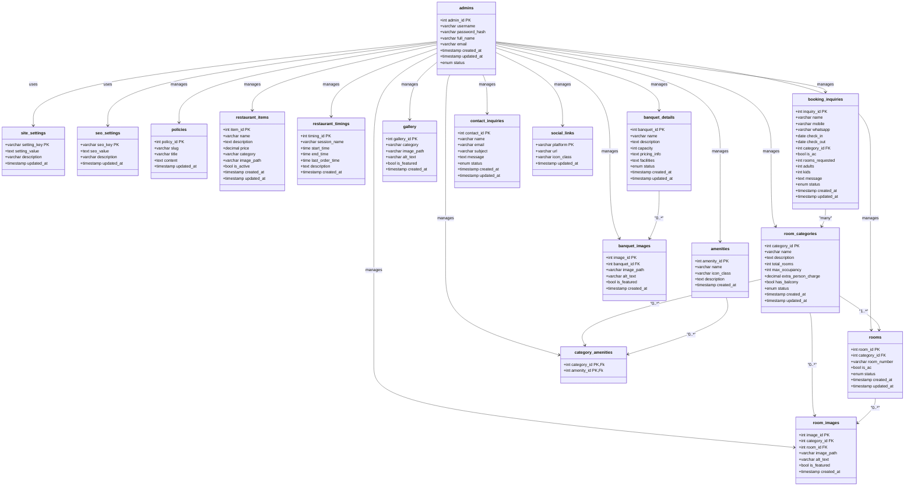

# Database Schema Diagram (Mermaid)

```mermaid
classDiagram
    direction TB
    class admins {
        +int admin_id PK
        +varchar username
        +varchar password_hash
        +varchar full_name
        +varchar email
        +timestamp created_at
        +timestamp updated_at
        +enum status
    }
    class site_settings {
        +varchar setting_key PK
        +text setting_value
        +varchar description
        +timestamp updated_at
    }
    class seo_settings {
        +varchar seo_key PK
        +text seo_value
        +varchar description
        +timestamp updated_at
    }
    class policies {
        +int policy_id PK
        +varchar slug
        +varchar title
        +text content
        +timestamp updated_at
    }
    class room_categories {
        +int category_id PK
        +varchar name
        +text description
        +int total_rooms
        +int max_occupancy
        +decimal extra_person_charge
        +bool has_balcony
        +enum status
        +timestamp created_at
        +timestamp updated_at
    }
    class rooms {
        +int room_id PK
        +int category_id FK
        +varchar room_number
        +bool is_ac
        +enum status
        +timestamp created_at
        +timestamp updated_at
    }
    class room_images {
        +int image_id PK
        +int category_id FK
        +int room_id FK
        +varchar image_path
        +varchar alt_text
        +bool is_featured
        +timestamp created_at
    }
    class amenities {
        +int amenity_id PK
        +varchar name
        +varchar icon_class
        +text description
        +timestamp created_at
    }
    class category_amenities {
        +int category_id PK,Fk
        +int amenity_id PK,Fk
    }
    class restaurant_items {
        +int item_id PK
        +varchar name
        +text description
        +decimal price
        +varchar category
        +varchar image_path
        +bool is_active
        +timestamp created_at
        +timestamp updated_at
    }
    class restaurant_timings {
        +int timing_id PK
        +varchar session_name
        +time start_time
        +time end_time
        +time last_order_time
        +text description
        +timestamp created_at
    }
    class banquet_details {
        +int banquet_id PK
        +varchar name
        +text description
        +int capacity
        +text pricing_info
        +text facilities
        +enum status
        +timestamp created_at
        +timestamp updated_at
    }
    class banquet_images {
        +int image_id PK
        +int banquet_id FK
        +varchar image_path
        +varchar alt_text
        +bool is_featured
        +timestamp created_at
    }
    class gallery {
        +int gallery_id PK
        +varchar category
        +varchar image_path
        +varchar alt_text
        +bool is_featured
        +timestamp created_at
    }
    class booking_inquiries {
        +int inquiry_id PK
        +varchar name
        +varchar mobile
        +varchar whatsapp
        +date check_in
        +date check_out
        +int category_id FK
        +bool is_ac
        +int rooms_requested
        +int adults
        +int kids
        +text message
        +enum status
        +timestamp created_at
        +timestamp updated_at
    }
    class contact_inquiries {
        +int contact_id PK
        +varchar name
        +varchar email
        +varchar subject
        +text message
        +enum status
        +timestamp created_at
        +timestamp updated_at
    }
    class social_links {
        +varchar platform PK
        +varchar url
        +varchar icon_class
        +timestamp updated_at
    }

    admins --> site_settings : uses
    admins --> seo_settings : uses
    admins --> policies : manages
    admins --> room_categories : manages
    admins --> rooms : manages
    admins --> room_images : manages
    admins --> amenities : manages
    admins --> category_amenities : manages
    admins --> restaurant_items : manages
    admins --> restaurant_timings : manages
    admins --> banquet_details : manages
    admins --> banquet_images : manages
    admins --> gallery : manages
    admins --> booking_inquiries : manages
    admins --> contact_inquiries : manages
    admins --> social_links : manages
    room_categories --> rooms : "1..*"
    room_categories --> room_images : "0..*"
    rooms --> room_images : "0..*"
    room_categories --> category_amenities : "0..*"
    amenities --> category_amenities : "0..*"
    banquet_details --> banquet_images : "0..*"
    booking_inquiries --> room_categories : "many"
```
